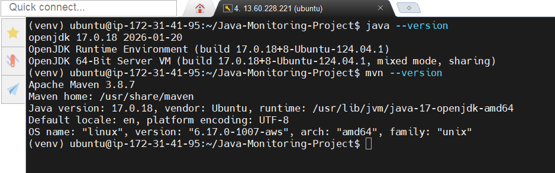
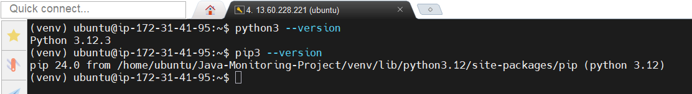

**Module 4 – Environment Setup and Tool Versions**

##Java
java -version
openjdk version "17.0.18"  
##Maven
mvn -version
Apache Maven 3.8.7

***********************************************************
**Node.js**
node -v
v18.17.0
NPM
npm -v
9.6.7
*********************************************************
**Python**
python3 --version
Python 3.10.12
**Pip**
pip3 --version
pip 22.0.2

**************************************************************
.NET SDK
dotnet --version
7.0.401

