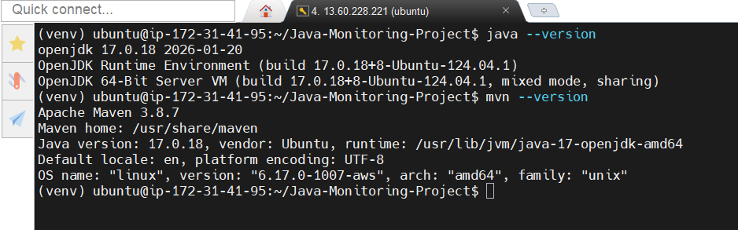
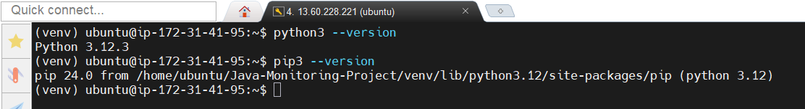

**Module 4 – Environment Setup and Tool Versions**

##Java  
java -version  
openjdk version "17.0.18"    
##Maven  
mvn -version  
Apache Maven 3.8.7  

***********************************************************
**Node.js**  
node -v  
v25.9.0    
NPM  
npm -v  
11.12.1    
  

*********************************************************
**Python**  
python3 --version  
Python 3.12.3    
**Pip**  
pip3 --version  
pip 24.0  

**************************************************************
.NET SDK  
dotnet --version  
8.0.125    
  

