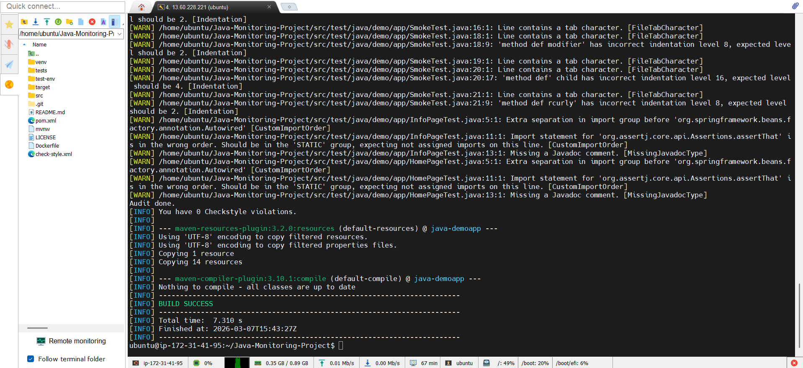
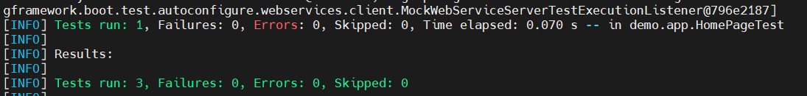
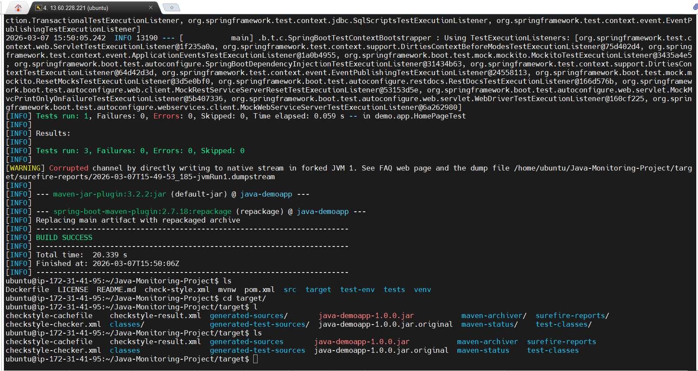
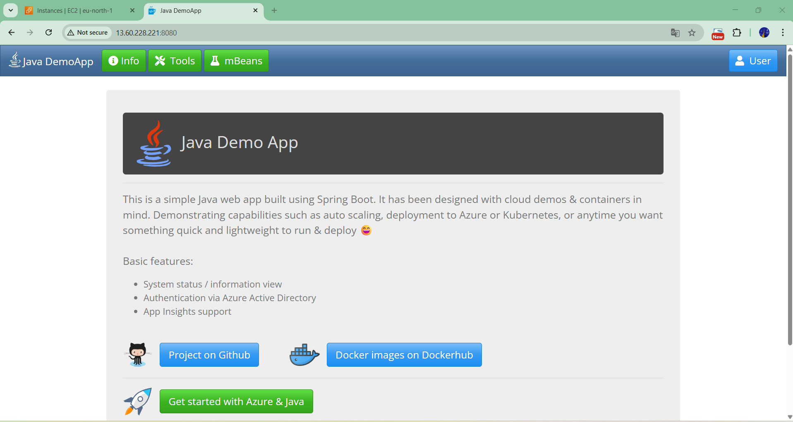
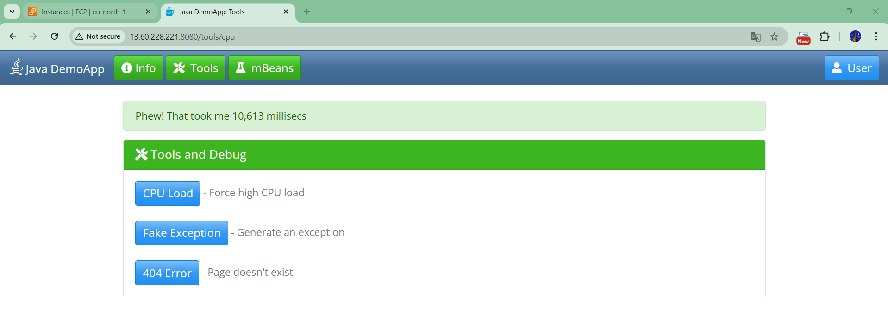
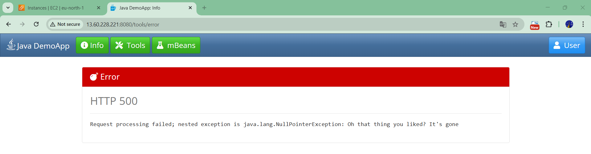

**Java + Maven Application Build and Run**
sudo apt update
sudo apt upgrade
sudo apt install openjdk-17-jdk -y
sudo apt install maven -y
mvn compile (run where pom.xml is present) (target folder generated)
mvn test 
mvn package (jar file generated)
java -jar java-demoapp-1.0.0.jar 

