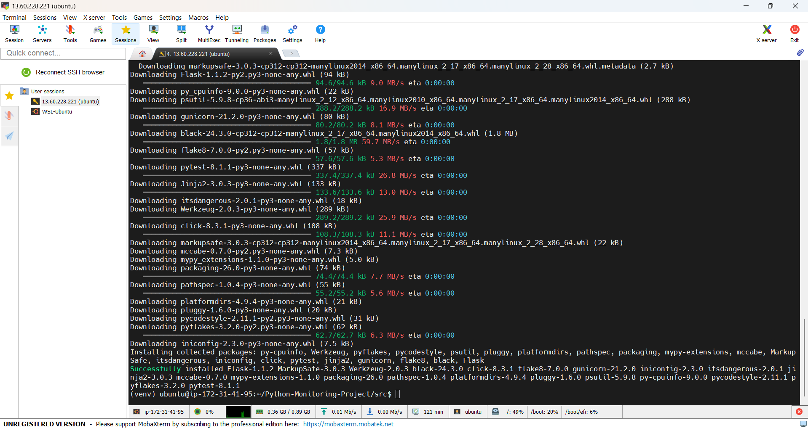
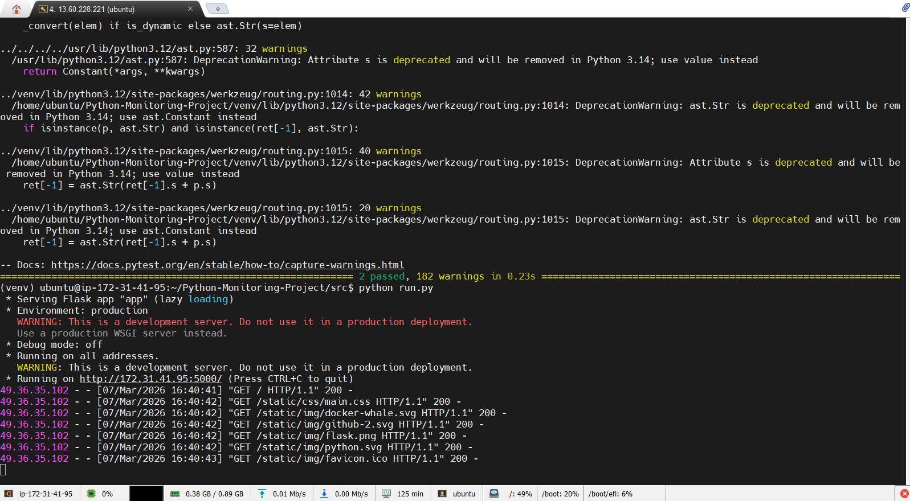
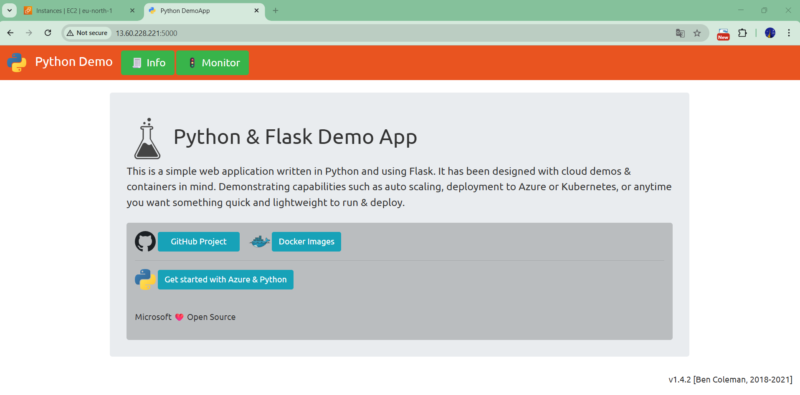
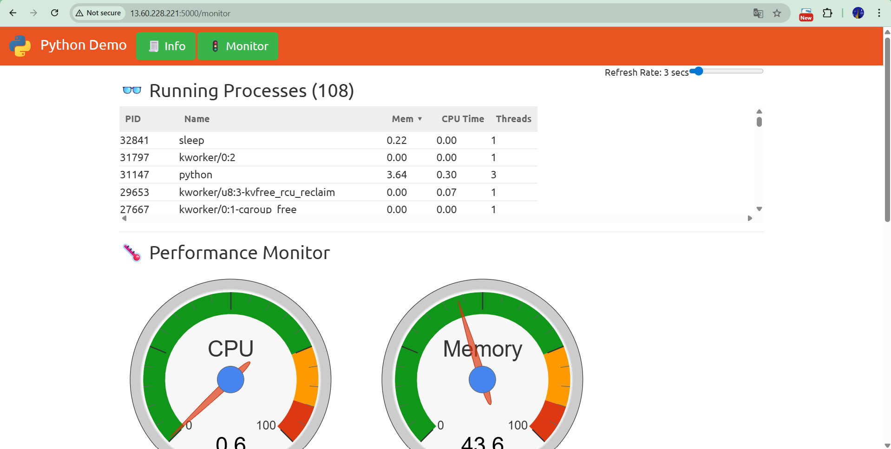

**Python3 + pip + venv Application Build and Run**  
sudo apt update  
sudo apt upgrade  
sudo apt install python3.12-venv  
python3 -m venv venv  
source venv/bin/activate  
pip install -r requirements.txt  
pytest -v  
pyhton run.py  

  
  
  
  
